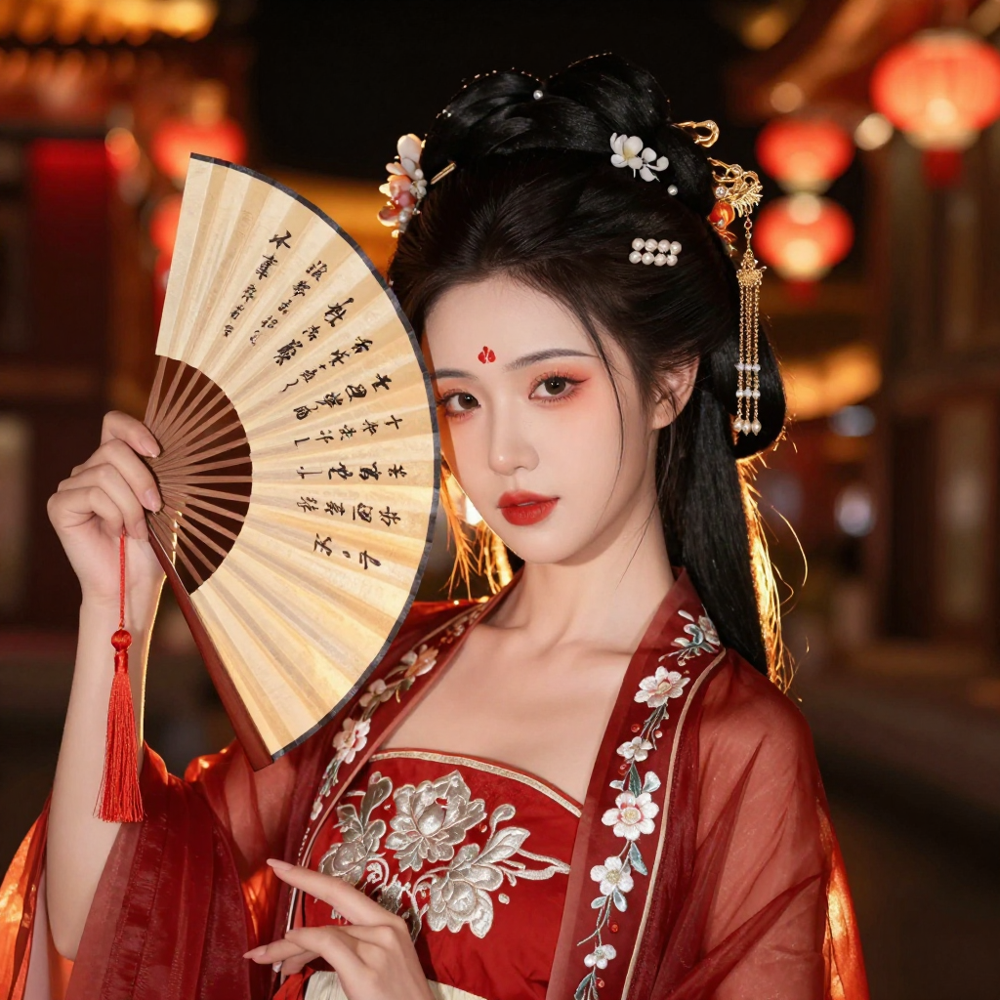
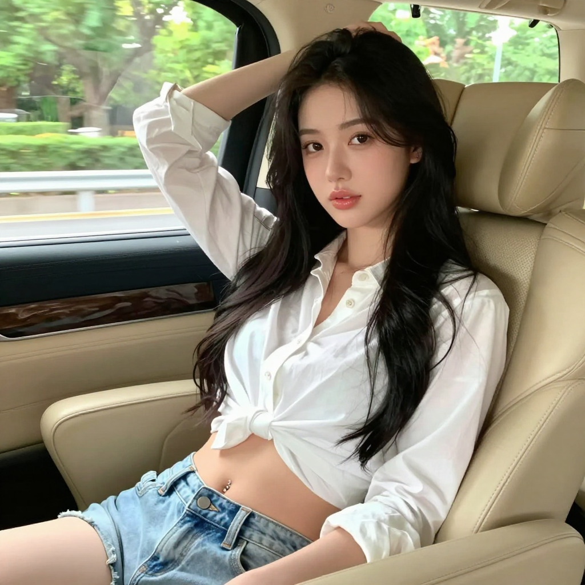
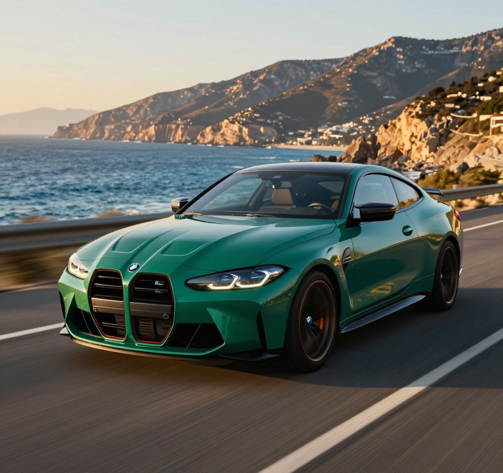
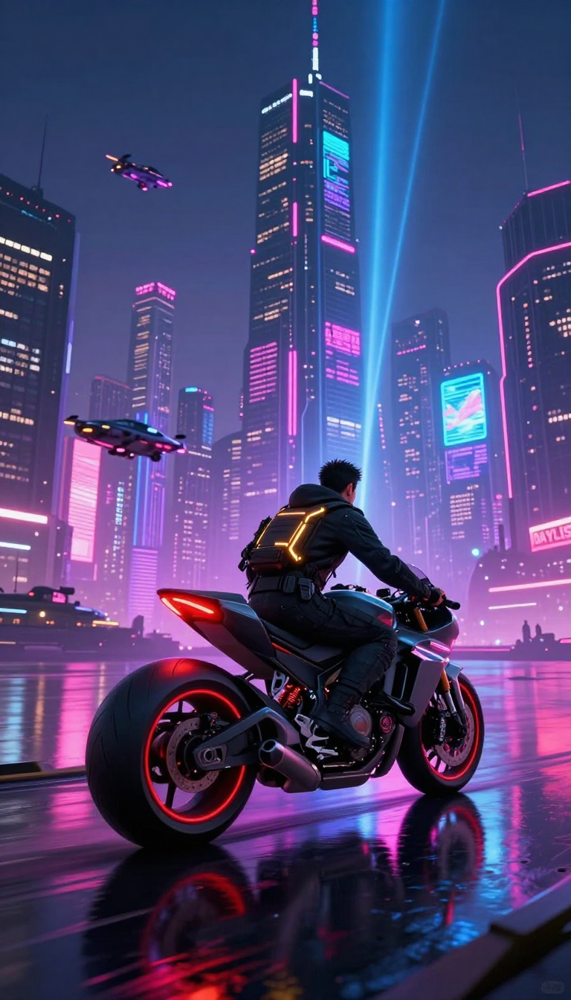

# 🚀 Z-Image-Turbo-Ultimate

**Z-Image-Turbo-Ultimate** 是一个专为高性能本地部署设计的高级 WebUI 工程。

本项目基于阿里通义 [Tongyi-MAI/Z-Image-Turbo](https://huggingface.co/Tongyi-MAI/Z-Image-Turbo "null") 模型，针对 **Apple Silicon (M1/M2/M3/M4)** 和 **NVIDIA RTX (Windows)** 进行了深度底层优化。通过 Bfloat16 精度、VAE FP32 混合精度推理以及手动 LoRA 注入技术，实现了**极速、高清、低显存占用**的完美平衡。


## ✨ 核心特性 (Key Features)

### 🍎 Mac (Apple Silicon) 深度优化

*   **Bfloat16 原生加速**：摒弃低效的 FP32，利用 M 系列芯片原生的 `bfloat16` 指令集，速度提升 200%，显存占用减半，解决了 FP16 溢出导致的黑屏问题。
*   **VAE 混合精度修复**：优化推理管线，主模型跑在 BF16，但强制 VAE 解码器运行在 FP32，**根除**Bfloat16 带来的画面模糊问题，实现像素级锐利。
*   **显存智能管理**：针对 M1 Max 等大内存设备关闭 Tiling 以追求极致画质；针对小内存设备支持自动切片。

### 💻 Windows (NVIDIA) 完美兼容

*   **CUDA + FP16**：自动检测 NVIDIA 显卡，启用成熟的 FP16 半精度推理。
*   **CPU Offload**：针对 8GB/12GB 显存的显卡（如 RTX 4070 Laptop），自动开启 CPU 卸载功能，防止爆显存。

### 🎨 独家画质增强

*   **内置色彩增强 LoRA**：集成了 `Technically-Color` LoRA 的手动注入算法。
*   **Refiner 层精准注入**：重写了 LoRA 加载逻辑，能够正确识别并注入 Z-Image 特有的 `context_refiner` 和 `noise_refiner` 层，带来远超原版的色彩饱和度和光影质感。

### 🛠 工程化架构

*   **模块化设计**：核心引擎、配置、UI 分离，易于维护和二次开发。
*   **专业级 WebUI**：支持种子固定/随机切换、LoRA 开关/强度调节、实时设备状态监控。
  

## 🤩 生成效果图










## 📂 项目结构

```bash
Z-Image-Project/
├── app.py                  # [入口] 程序启动入口
├── config.py               # [配置] 全局参数与路径配置
├── core/                   # [核心] 核心逻辑包
│   ├── engine.py           # 推理引擎 (加载/卸载/优化)
│   ├── lora_manager.py     # LoRA 手动注入管理器
│   └── utils.py            # 硬件检测工具
├── requirements.txt        # [依赖] 项目依赖列表
├── examples/               # 图片生成结果示例
└── README.md               # 说明文档

```

## 🚀 快速开始 (Quick Start)

### 1. 环境准备

**Python 版本要求**：建议 Python 3.10 或 3.11 (暂不支持 3.13)。

**安装依赖**：

推荐使用 requirements.txt 一键安装所有依赖：

```shell
pip install -r requirements.txt

```
或者手动安装：

```shell
pip install torch torchvision torchaudio
pip install gradio transformers accelerate protobuf sentencepiece safetensors huggingface_hub
# 安装 Diffusers (开发版)
pip install git+https://github.com/huggingface/diffusers.git

```

### 2. 模型准备

请确保项目根目录下有以下文件/文件夹：

1.  **基础模型**：`./Z-Image-Model` (从 HuggingFace 下载的完整文件夹)
2.  **LoRA 文件**：`./Technically_Color_Z_Image_Turbo_v1_renderartist_2000.safetensors`（需要单独下载）

*提示：可以在 `config.py` 中修改这些路径。*

### 3. 运行

在项目根目录下运行：

```shell
python app.py

```

等待终端显示 `Running on local URL: http://127.0.0.1:7860` 后，在浏览器打开即可。

## ⚙️ 参数指南

| 参数               | 推荐值   | 说明                                                   |
| :----------------- | :------- | :----------------------------------------------------- |
| **Steps (步数)**   | **9**    | Turbo 模型特化步数，9步即可获得最佳细节。              |
| **CFG (引导系数)** | **0.0**  | Z-Image-Turbo 推荐设为 0。过高会导致画面纹理劣化。     |
| **LoRA Scale**     | **1.3**  | 配合 Technically-Color LoRA 的最佳甜点值，色彩最通透。 |
| **Width/Height**   | **768~1024** | 训练时的原生分辨率。M1 Max 64G、RTX4080 12G及以上配置 可尝试挑战 2048。           |

## ❓ 常见问题 (FAQ)

### Q1: 为什么我的 Mac 上生成的图片很模糊？

**A**: 请确保您使用的是本项目提供的最新代码，通过强制 `VAE` 使用 `float32` 精度解决了这个问题。如果仍然模糊，请检查 `config.py` 中的设置。

### Q2: Windows 上报错 `Torch not compiled with CUDA enabled`？

**A**: 您可能安装了 CPU 版的 PyTorch。请卸载后运行： `pip3 install torch torchvision torchaudio --index-url https://download.pytorch.org/whl/cu121`

### Q3: 如何更换其他 LoRA？

**A**:

1.  将新的 `.safetensors` 文件放入项目目录。
2.  修改 `config.py` 中的 `LORA_PATH`。
3.  重启程序即可。
  
### Q4: 需要什么配置？

**A**: Mac用户推荐M1 Pro 32G内存及以上；Windows独立显卡用户推荐RTX4060 8G显存及以上、无独立显卡推荐64G内存及以上


## 📝 许可证

本项目代码遵循 MIT 许可证。模型权重请遵循 [Tongyi-MAI](https://huggingface.co/Tongyi-MAI/Z-Image-Turbo "null") 的官方开源协议。


